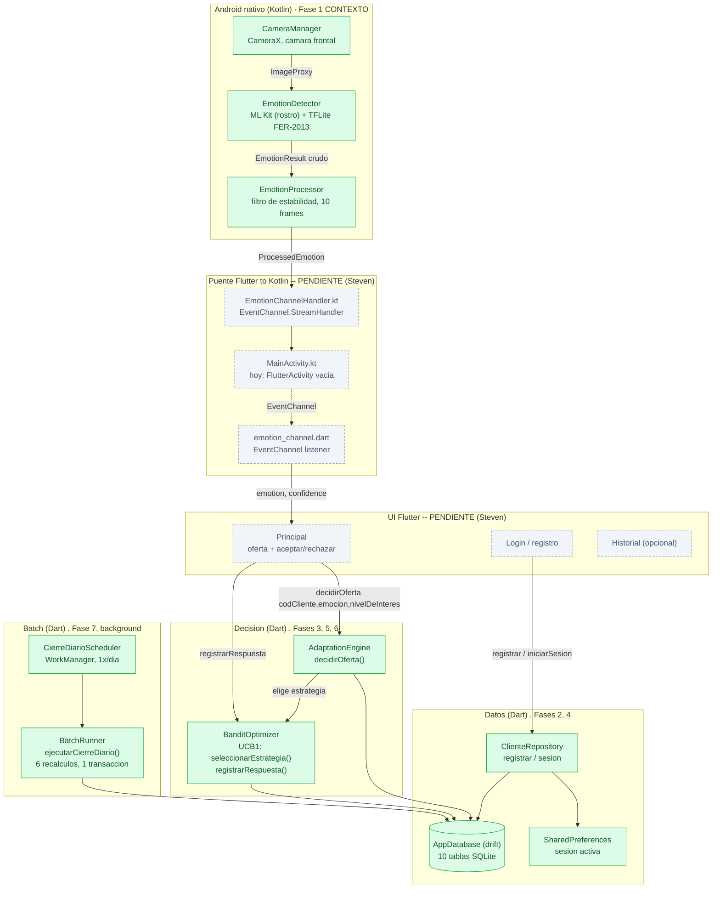
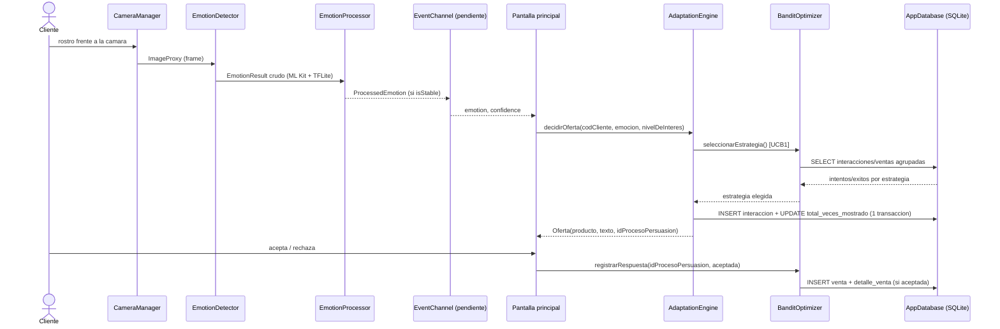

# Arquitectura — Sistema Inteligente de Ventas (Cierre de Ventas)

App Flutter/Dart con un módulo nativo Kotlin (cámara + ML) para detectar la emoción del
cliente en tiempo real y adaptar la oferta mostrada. Sin backend: todo corre on-device,
persistencia local en SQLite (`drift`).

Generado leyendo el código fuente (no con herramienta externa). Ver también el grafo de
conocimiento ya construido con `graphify` en `docs/graphify-out/` (`graph.html`,
`GRAPH_REPORT.md`) para explorar relaciones archivo a archivo.

## Diagrama de componentes

Verde = implementado y probado. Gris punteado = diseñado pero **aún no conectado**
(según `docs/GUIA_STEVEN.md` — el puente Kotlin↔Flutter y las 3 pantallas de UI).



## Flujo de ejecución (caso principal)



## Capas y responsables

| Capa | Componentes | Responsable | Estado |
|---|---|---|---|
| Contexto (cámara + ML) | `CameraManager`, `EmotionDetector`, `EmotionProcessor` | Juan | Implementado |
| Puente nativo↔Flutter | `EmotionChannelHandler.kt`, canal en `MainActivity.kt`, `emotion_channel.dart` | Steven | **Pendiente** (diseño listo en `GUIA_STEVEN.md`) |
| UI | Login, Principal, Historial | Steven | **Pendiente** |
| Decisión | `AdaptationEngine` (reglas por emoción), `BanditOptimizer` (UCB1) | Elvis | Implementado, probado |
| Datos / Auth | `ClienteRepository`, `AppDatabase` (drift, 10 tablas), `SharedPreferences` | Elvis | Implementado, probado |
| Batch | `CierreDiarioScheduler` (WorkManager), `BatchRunner` | Elvis | Implementado, probado; disparo diario recién conectado en `main.dart` |

## Notas de arquitectura

- **Sin backend ni red**: todo el pipeline (cámara → clasificación → decisión → persistencia)
  corre en el dispositivo. El modelo FER-2013 (`emotion_model.tflite`) va empaquetado como asset.
- **Reglas de adaptación** (`AdaptationEngine`): triste → sustituto más barato, feliz → premium,
  sorpresa → producto poco mostrado, neutral → producto más mostrado, enojo → cambia de categoría
  + el más barato de ella.
- **Aprendizaje en vivo vs batch**: `BanditOptimizer` recalcula éxitos/intentos por estrategia
  *en cada decisión* directo desde `interacciones`/`ventas` (UCB1). El `BatchRunner` diario
  actualiza columnas derivadas (`totalVecesAplicada`, `ventasGeneradas`, etc.) que son
  exclusivas para KPIs de presentación — deliberadamente no se cruzan con el cálculo en vivo.
  Ver `docs/PLAN_ELVIS.md` sección 6.
- **`main.dart` actual** todavía es la plantilla de `flutter create` + el disparo del cierre
  diario; no está conectado a `ClienteRepository`/`AdaptationEngine`/`BanditOptimizer` — ese
  cableado es justamente el trabajo pendiente de Steven (`docs/GUIA_STEVEN.md`).
- **`id_proceso_persuasion`** es la clave que conecta un intento de persuasión
  (`interacciones`) con su cierre (`ventas`) — corrección C1 documentada en
  `docs/ESQUEMA_CORREGIDO.md`, sin la cual no se podría medir conversión.

## Cómo verlo

- GitHub y VS Code (extensión *Markdown Preview Mermaid Support* o el preview nativo de
  Markdown) renderizan los bloques ` ```mermaid ` de este archivo directamente.
- Para explorar relaciones archivo a archivo con más detalle: `graphify query "<pregunta>"`
  sobre el grafo ya construido en `docs/graphify-out/`.
