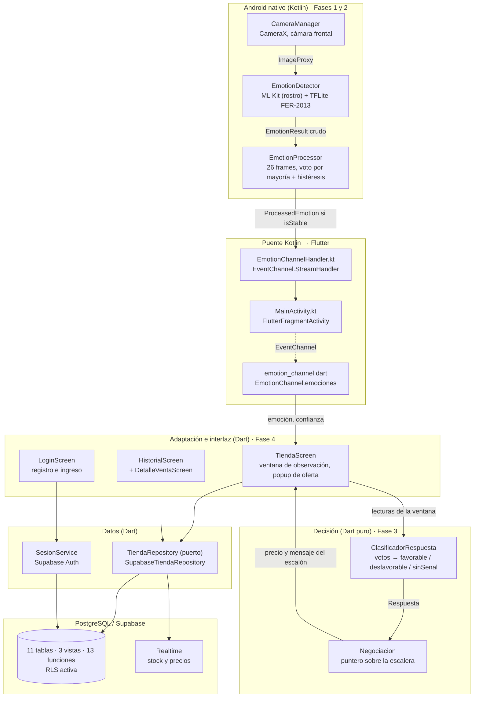
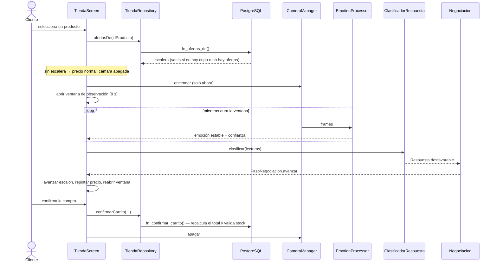

# Arquitectura — Sistema Inteligente de Ventas (Tienda Adaptativa)

App Flutter/Dart con un módulo nativo Kotlin (cámara + ML) que lee la respuesta emocional
del cliente y la usa para avanzar por una **escalera de ofertas** configurada en el
servidor. El pipeline de visión corre on-device —ninguna imagen sale del teléfono—; el
catálogo, el stock, las ofertas y las ventas viven en una base PostgreSQL compartida
(Supabase), que es lo que permite administrar la tienda desde un panel y que el stock se
vea igual en todos los dispositivos. Ver [supabase/README.md](../supabase/README.md).

> **La emoción no calcula el descuento.** Decide si el sistema se queda donde está o pasa
> al siguiente escalón de una escalera que vive en la base de datos. Los porcentajes y su
> orden los publica un administrador; la app no inventa precios.

Documento generado leyendo el código fuente.

## Diagrama de componentes



## Flujo de ejecución (caso principal)



## Capas y responsables

| Capa | Componentes | Responsable |
|---|---|---|
| Contexto (cámara + ML) | `CameraManager`, `EmotionDetector` | Juan |
| Procesamiento | `EmotionProcessor` (ventana de 26 frames) | Juan |
| Puente nativo↔Flutter | `EmotionChannelHandler.kt`, `MainActivity.kt`, `emotion_channel.dart` | Steven |
| Decisión | `ClasificadorRespuesta`, `Negociacion` (`lib/decision/negociacion.dart`) | Elvis |
| Adaptación / UI | `TiendaScreen`, `PopupOferta`, `CarritoHoja`, historial | Steven |
| Datos / Auth | `TiendaRepository` + `SupabaseTiendaRepository`, `SesionService` | Elvis |
| Backend | 14 migraciones en `supabase/migrations/`, RLS y funciones validadas | Elvis |

## Notas de arquitectura

- **Visión on-device, datos compartidos.** Cámara, detección y clasificación corren en el
  teléfono: el modelo FER-2013 (`emotion_model.tflite`) va empaquetado como asset y ningún
  frame se transmite ni se guarda. Ni siquiera la etiqueta de emoción sale del dispositivo
  — se consume en `TiendaScreen`. La persistencia sí es remota: una sola base para todos.

- **La cámara solo vive durante una negociación.** Se enciende al seleccionar un producto
  y se apaga al comprar, al abandonar o al agotarse la escalera. No es solo batería:
  mantenerla viva mientras alguien navega un catálogo es bastante más invasivo.

- **Escrituras por función, no por `INSERT`.** La clave que viaja dentro del APK solo
  concede lectura. Registrar un cliente o una venta pasa por funciones `SECURITY DEFINER`
  que validan y ejecutan de forma atómica (`0002_funciones.sql`). `fn_confirmar_carrito`
  no recibe el total —lo recalcula— ni el id del cliente, que saca del token. Por eso dos
  compras simultáneas no pueden vender la misma unidad: el descuento de stock ocurre bajo
  `FOR UPDATE`.

- **La decisión es Dart puro.** `ClasificadorRespuesta` recibe una lista de etiquetas y
  `Negociacion` mantiene un puntero (`-1` = precio normal, `0..n-1` = escalón). Ninguno de
  los dos conoce la cámara ni los widgets, y por eso las 158 pruebas corren sin
  dispositivo, sin emulador y sin backend.

- **Dónde está el ruido, y por qué hay dos filtros.** El clasificador alterna entre clases
  fotograma a fotograma, así que `EmotionProcessor` vota sobre 26 frames con histéresis
  (Kotlin) y `ClasificadorRespuesta` vuelve a votar sobre las lecturas estables de la
  ventana de 8 s (Dart). El primero estabiliza la *señal*; el segundo, la *decisión*.

- **`main.dart`** inicializa Supabase con la URL y la clave inyectadas al compilar; si
  faltan, arranca en `ConfiguracionFaltanteScreen` en lugar de fallar. También compara el
  commit del build contra `app_config` para avisar de versiones nuevas.

- **Degradación sin detector.** En web o escritorio `EmotionChannel.disponible` es `false`:
  la negociación se queda en el precio normal y la ventana no se abre, en vez de dejar al
  cliente esperando una evaluación que nunca llega.

## Cómo verlo

GitHub y VS Code (preview nativo de Markdown, o la extensión *Markdown Preview Mermaid
Support*) renderizan los bloques ` ```mermaid ` de este archivo directamente.
